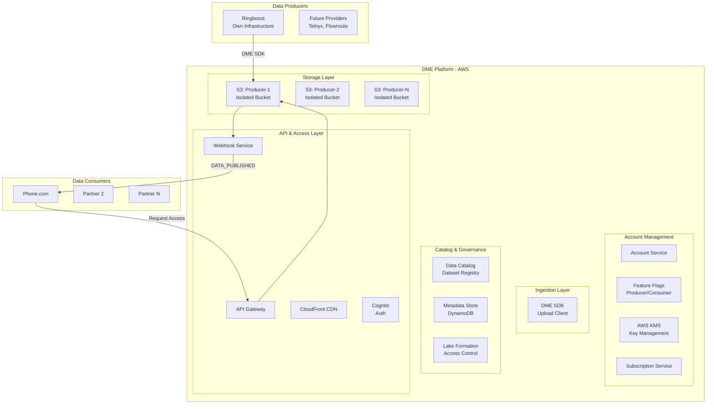
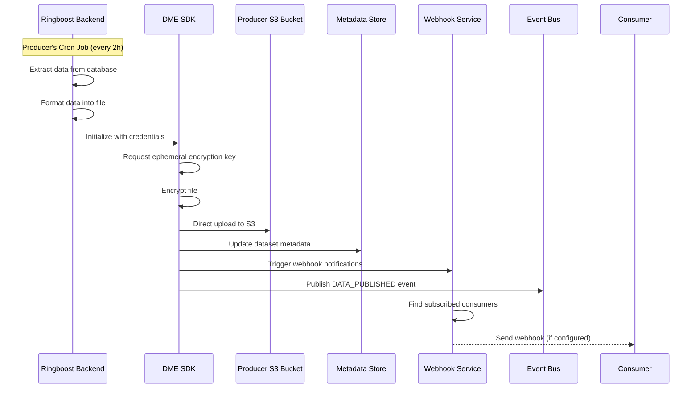
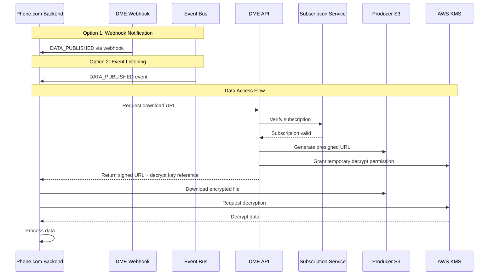

# DME - Data Marketplace Exchange Architecture Document

## Executive Summary

DME (Data Marketplace Exchange) is a secure data exchange platform where data producers can publish encrypted datasets that data consumers can subscribe to and access. Initially focused on phone number data from providers like Ringboost, DME aims to become a comprehensive data marketplace supporting multiple data types and industries.

## Table of Contents
1. [Solution Architecture](#solution-architecture)
2. [Onboarding & Data Flow](#onboarding--data-flow)
3. [API Architecture](#api-architecture)
4. [Data Exchange Features](#data-exchange-features)
5. [Business Model](#business-model)
6. [Implementation Roadmap](#implementation-roadmap)
7. [Infrastructure & DevOps](#infrastructure--devops)

---

## Solution Architecture

### High-Level Architecture

DME operates as a pure data exchange platform - we facilitate secure data transfer between producers and consumers without processing or transforming the data. Data producers maintain control over their upload schedules and data freshness.



### Key Architecture Principles

1. **Data Exchange Only**: DME does not process, transform, or manipulate data - we provide secure exchange infrastructure
2. **Producer Autonomy**: Data producers control their upload schedules and data freshness
3. **Storage Isolation**: Each producer gets a dedicated S3 bucket for complete isolation
4. **SDK-Based Upload**: Phase 1 uses DME SDK for uploads (future phases may add SFTP, API, etc.)
5. **Event-Driven Notifications**: `DATA_PUBLISHED` event and optionally webhook notifications to consumers when new data arrives

---

## Onboarding & Data Flow

### Data Producer Onboarding (e.g., Ringboost)

#### Account Setup
1. Producer creates an account in DME platform
2. Account is tagged with `DATA_PRODUCER` feature flag
3. Dedicated S3 bucket provisioned: `s3://dme-producer-{account-id}/`
4. Master encryption key created in AWS KMS
5. DME SDK credentials generated

#### Producer Infrastructure Requirements
- Producer maintains their own cron jobs/schedulers
- Producer determines upload frequency (this defines data freshness)
- Producer is responsible for data extraction from their systems
- Producer uses DME SDK to upload encrypted data

### Data Production Workflow



#### Event Payload Structure
The `DATA_PUBLISHED` event sent to consumer webhooks:

```json
{
  "eventType": "DATA_PUBLISHED",
  "producerId": "ringboost-account-id",
  "datasetId": "phone-numbers-dataset",
  "payload": {
    "fileLocation": "s3://dme-producer-xxx/2025/01/data.enc.gz",
    "fileSize": 1048576,
    "recordCount": 50000,
    "timestamp": "2025-01-27T14:00:00Z",
    "checksum": "sha256:abcd1234...",
    "schemaVersion": "v2.1",
    "metadata": {
      "dataType": "phone_numbers",
      "coverage": "US_CANADA"
    }
  }
}
```

### Data Consumer Onboarding (e.g., Phone.com)

#### Account Setup
1. Consumer creates account in DME
2. Account tagged with `DATA_CONSUMER` feature flag
3. API credentials generated
4. Optional: Configure webhook endpoint for notifications

#### Subscription Management
- Subscriptions are stored in a separate mapping service (not in account objects)
- Many-to-many relationship: consumers ↔ datasets
- Subscription states: pending, approved, active, suspended
- Producers approve/deny subscription requests

### Data Consumption Workflow



**Note**: Data consumers are notified of new data through either:
1. **Webhook**: Direct HTTP callback to configured endpoint
2. **Event Listening**: Subscribing to DATA_PUBLISHED events on the event bus

NOTE: There is no polling mechanism.

### Subscription Mapping Architecture

Instead of storing subscriptions in account objects, we use a dedicated service:

```yaml
Subscription Service:
  Storage: DynamoDB tables
  
  Tables:
    Subscriptions:
      - SubscriptionID (PK)
      - ConsumerID
      - ProducerID
      - DatasetID
      - Status
      - ApprovedBy
      - CreatedAt
      - UpdatedAt
    
    ConsumerWebhooks:
      - ConsumerID (PK)
      - WebhookURL
      - Secret
      - Active
      - LastCalled
      - FailureCount
    
    DatasetConsumers:
      - DatasetID (PK)
      - ConsumerID (SK)
      - SubscriptionID
      - AccessLevel
```

This design scales better as it:
- Avoids large lists in account objects
- Enables efficient queries by dataset or consumer
- Supports complex subscription rules
- Allows for future sharding

---

## API Architecture

### API Endpoints Structure

```yaml
Authentication:
  POST   /auth/login
  POST   /auth/refresh
  POST   /auth/logout
  
Account Management:
  GET    /account/profile
  PUT    /account/profile
  POST   /account/enable-feature    # Add producer/consumer capability
  
Producer APIs:
  POST   /producer/datasets         # Register new dataset
  GET    /producer/datasets         # List my datasets
  PUT    /producer/datasets/{id}    # Update dataset metadata
  GET    /producer/subscribers      # List pending/active subscribers
  POST   /producer/approve          # Approve subscription request
  POST   /producer/reject           # Reject subscription request
  GET    /producer/upload-config    # Get S3 upload configuration
  
Consumer APIs:
  GET    /consumer/catalog          # Browse available datasets
  POST   /consumer/subscribe        # Request subscription
  DELETE /consumer/unsubscribe      # Cancel subscription
  GET    /consumer/subscriptions    # List my subscriptions
  GET    /consumer/download/{id}    # Get download URL
  PUT    /consumer/webhook          # Configure webhook endpoint
  
Marketplace APIs:
  GET    /marketplace/datasets      # Public catalog
  GET    /marketplace/dataset/{id}  # Dataset details
  GET    /marketplace/providers     # List all providers
  GET    /marketplace/pricing       # Pricing information
```

### Rate Limiting Strategy

Tiered rate limiting based on subscription level:

```yaml
Starter Tier:
  Requests per second: 10
  Burst limit: 20
  Monthly API calls: 1,000,000
  Download bandwidth: 100 GB/month

Professional Tier:
  Requests per second: 50
  Burst limit: 100
  Monthly API calls: 10,000,000
  Download bandwidth: 1,000 GB/month

Enterprise Tier:
  Requests per second: 200
  Burst limit: 400
  Monthly API calls: Unlimited
  Download bandwidth: 10,000 GB/month
  Direct S3 access: Available
```

### Authentication & Authorization

```yaml
Authentication:
  Primary: AWS Cognito with JWT tokens
  Secondary: API Keys for programmatic access
  MFA: Optional for high-tier accounts

Authorization:
  Resource-based: Access only to subscribed datasets
  Time-based: Historical data access based on tier
  Volume-based: Monthly download limits
  Feature-based: Producer vs Consumer capabilities
```

---

## Data Exchange Features

### Data Quality Framework

Quality evaluation happens at different points:

```yaml
Quality Checkpoints:
  
  Producer Responsibility:
    - Data completeness before upload
    - Format validation
    - Business rule compliance
    - Schema adherence
    
  DME Platform Validation:
    - File integrity (checksum verification)
    - Schema version compatibility
    - File size and format validation
    - Metadata completeness
    
  Consumer-Side Validation:
    - Post-download integrity check
    - Schema validation against expectations
    - Business rule validation for their use case
    - Quality metrics reporting back to DME
```

### Data Freshness Monitoring

```yaml
Freshness Tracking:
  
  Producer-Defined SLAs:
    - Expected update frequency per dataset
    - Freshness commitments in dataset metadata
    - Automated alerts for missed updates
  
  Platform Monitoring:
    - Last upload timestamp tracking
    - Freshness score calculation
    - Consumer notifications for delays
    - SLA compliance reporting
  
  Consumer Visibility:
    - Real-time freshness status
    - Historical update patterns
    - Predictive update timing
```

### Data Lineage (Simplified for Exchange Model)

Without a processing layer, lineage focuses on exchange tracking:

```yaml
Exchange Lineage:
  
  Upload Lineage:
    - Producer account ID
    - Upload timestamp
    - File characteristics (size, checksum)
    - Schema version
    - Encryption key reference
    
  Access Lineage:
    - Consumer access logs
    - Download timestamps
    - Access patterns
    - Usage analytics
    
  Audit Trail:
    - Complete chain of custody
    - Compliance reporting
    - Access audit logs
    - Data retention tracking
```

---

## Business Model

### Pricing Structure

```yaml
Producer Costs (What Ringboost Pays):
  
  Base Platform Fee:
    - Starter: $500/month (up to 1TB storage)
    - Professional: $2,000/month (up to 10TB)
    - Enterprise: Custom pricing
  
  Usage-Based Costs:
    - Storage: $0.03/GB/month (S3 + margin)
    - Bandwidth: $0.05/GB transferred
    - API calls: $1 per million calls
  
  Revenue Sharing:
    - 70% of consumer fees to producer
    - 30% retained by DME platform

Consumer Pricing (What Phone.com Pays):
  
  Starter Tier: $299/month
    - 100 GB data transfer
    - 1 dataset subscription
    - 3 months historical data
    - Email support
  
  Professional Tier: $999/month
    - 1,000 GB data transfer
    - 5 dataset subscriptions
    - 12 months historical data
    - Webhook notifications
    - Priority support
  
  Enterprise Tier: $4,999/month
    - 10,000 GB data transfer
    - Unlimited datasets
    - All historical data
    - Direct S3 access
    - Dedicated support
    - Custom SLA
```

### Revenue Model

```yaml
Revenue Streams:
  
  1. Producer Platform Fees:
     - Monthly base fee
     - Storage overage charges
     - Additional feature add-ons
  
  2. Consumer Subscriptions:
     - Monthly subscription fees
     - Overage charges
     - Premium feature fees
  
  3. Transaction Fees:
     - Per-transaction micropayments (future)
     - API call charges above limits
  
  4. Value-Added Services (Future):
     - Data quality certification
     - Custom integration support
     - Analytics and insights
```

---

## Implementation Roadmap

### Phase 1: MVP (Months 1-2)

#### Core Infrastructure
```yaml
Storage:
  - S3 bucket per producer with isolation
  - Bucket lifecycle policies
  - Encryption at rest with KMS

Security:
  - Cognito user pools
  - API Gateway with API keys
  - IAM roles and policies
  - KMS key management

Data Management:
  - DynamoDB for metadata
  - Dataset catalog
  - Subscription mappings
  - Webhook configurations

APIs:
  - Producer upload configuration
  - Consumer download endpoints
  - Subscription management
  - Webhook delivery service
```

#### DME SDK (Phase 1)
```yaml
SDK Features:
  - Authentication handling
  - Encryption/decryption
  - S3 multipart upload
  - Retry logic
  - Progress callbacks
  - Error handling

Supported Languages:
  - Go (reference implementation)
  - Python
  - Java
  - Node.js
```

#### Phase 1 Deliverables
- ✅ Account management system
- ✅ Producer/Consumer feature flags
- ✅ S3 bucket provisioning per producer
- ✅ DME SDK for data upload
- ✅ Download API with presigned URLs
- ✅ Subscription request/approval flow
- ✅ Webhook notifications for DATA_PUBLISHED
- ✅ Basic usage tracking
- ✅ JWT authentication via Cognito

### Phase 2: Enhanced Features (Months 3-4)

```yaml
Additional Upload Methods:
  - SFTP/FTPS support
  - Direct API upload
  - Database replication (AWS DMS)

Enhanced Features:
  - Data quality metrics dashboard
  - Advanced subscription rules
  - Billing integration (Stripe)
  - Partner web portal
  - Analytics dashboard
  - CloudWatch monitoring
```

### Phase 3: Scale & Optimize (Months 5-6)

```yaml
Scaling Features:
  - Multi-region support
  - CDN for global distribution
  - Advanced caching strategies
  - Performance optimization
  - Cost optimization automation
  - Disaster recovery
```

### Phase 4: Marketplace Platform (Months 7+)

#### Expanded Data Exchange Features

```yaml
Discovery & Search:
  - Advanced dataset search
  - AI-powered recommendations
  - Category browsing
  - Provider ratings

Data Exchange Enhancements:
  - Smart contracts for licensing
  - Automated billing settlements
  - Data bundling options
  - Try-before-buy samples
  - Quality certification program
  - Review and rating system
```

#### Advanced Governance

```yaml
Compliance Framework:
  - GDPR compliance tools
  - CCPA support
  - HIPAA readiness
  - Industry-specific compliance

Data Governance:
  - Consent management
  - Data residency controls
  - Retention policies
  - Right to be forgotten
  - Audit reporting
  - PII detection and masking
```

#### Future Vision: Beyond Phone Numbers

```yaml
Expansion Roadmap:
  
  Year 1: Telecom Data
    - Phone numbers
    - Carrier information
    - Number portability data
  
  Year 2: Business Data
    - Company profiles
    - Financial indicators
    - Industry benchmarks
  
  Year 3: Geographic Data
    - Real estate listings
    - Demographic data
    - Location intelligence
  
  Year 4: Real-time Streams
    - IoT sensor data
    - Market data feeds
    - Social media streams
  
  Year 5: AI/ML Marketplace
    - Trained models
    - Datasets for training
    - Inference APIs
```

---

## Infrastructure & DevOps

### Infrastructure Architecture

```yaml
Environment Strategy:
  
  Development:
    - Separate AWS account
    - Minimal resources (t3.micro)
    - Synthetic test data
    - Cost: ~$500/month
  
  Staging:
    - Separate AWS account
    - Production-like setup (50% scale)
    - Anonymized production data
    - Cost: ~$2,000/month
  
  Production:
    - Dedicated AWS account
    - Full scale, multi-AZ
    - High availability setup
    - Cost: $5,000-50,000/month (usage-based)
```

### Key Infrastructure Components

```yaml
Storage Layer:
  - S3 bucket per producer
  - Intelligent tiering for cost optimization
  - Cross-region replication for DR
  - Lifecycle policies for archival

Compute Layer:
  - Lambda for API endpoints
  - Step Functions for orchestration
  - ECS Fargate for long-running tasks

Database Layer:
  - DynamoDB for metadata
  - RDS PostgreSQL for analytics (future)
  - ElastiCache for API caching

Security Layer:
  - WAF for DDoS protection
  - GuardDuty for threat detection
  - Security Hub for compliance
  - Secrets Manager for credentials
```

### Monitoring & Observability

```yaml
Metrics to Track:
  
  Business Metrics:
    - Active producers
    - Active consumers
    - Total datasets
    - Monthly data volume
    - Revenue metrics
  
  Technical Metrics:
    - API latency (p50, p90, p99)
    - Upload success rate
    - Download success rate
    - Webhook delivery rate
    - Storage utilization
  
  Quality Metrics:
    - Data freshness scores
    - File integrity checks
    - Schema validation passes
    - Consumer satisfaction scores
```

---

## Security & Compliance

### Security Architecture

```yaml
Security Layers:
  
  Network Security:
    - Private subnets for compute
    - VPC endpoints for S3 access
    - WAF rules for API protection
    - DDoS protection with Shield
  
  Data Security:
    - Encryption at rest (AES-256)
    - Encryption in transit (TLS 1.3)
    - Customer-managed KMS keys
    - Ephemeral encryption keys
  
  Access Control:
    - IAM roles with least privilege
    - MFA for administrative access
    - API key rotation
    - Temporary credentials via STS
  
  Compliance:
    - SOC 2 Type II certification
    - GDPR compliance
    - CCPA compliance
    - Industry-specific requirements
```

### Data Privacy

```yaml
Privacy Controls:
  
  Data Isolation:
    - Separate S3 bucket per producer
    - Encryption with unique keys
    - No cross-producer access
  
  Access Logging:
    - All API calls logged
    - S3 access logging
    - CloudTrail for audit
  
  Data Residency:
    - Region-specific storage
    - No cross-region transfer without consent
    - Compliance with local regulations
```

---

## Cost Optimization

### Cost Management Strategy

```yaml
Storage Optimization:
  - S3 Intelligent-Tiering
  - Lifecycle policies to Glacier
  - Compression before storage
  - Deduplication where possible

Compute Optimization:
  - Right-sized Lambda functions
  - Reserved capacity for baseline
  - Spot instances for batch jobs
  - Auto-scaling based on demand

Network Optimization:
  - CloudFront caching
  - S3 Transfer Acceleration
  - VPC endpoints to avoid NAT costs
  - Compression for all transfers

Operational Optimization:
  - Automated cost reports
  - Budget alerts
  - Resource tagging for tracking
  - Regular cost reviews
```

---

## Conclusion

DME (Data Marketplace Exchange) provides a focused, scalable platform for secure data exchange between producers and consumers. By concentrating on the exchange infrastructure rather than data processing, DME can:

- Launch quickly with essential features
- Scale efficiently as demand grows
- Maintain clear boundaries and responsibilities
- Evolve into a comprehensive data marketplace
- Support multiple data types and industries over time

The architecture prioritizes security, scalability, and simplicity while providing clear paths for future expansion.